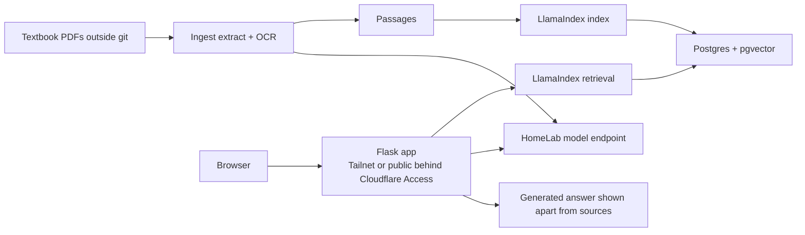

# med-ask

Search over a medical student's textbooks that returns the original passage, with book and page.

> [!WARNING]
> **In development.** Search returns original passages with book and page today; the search model is provisional and results may change.

## Overview

Built for a friend studying medicine across 13 textbooks and more than 12,500 pages.
med-ask finds the original passages, shows each with its book and page, and keeps the short generated answer separate.
The repository holds code only; passages, vectors and logs stay outside it, enforced by [the guard](scripts/check_no_data.py) and [CI](.github/workflows/ci.yml).

## Architecture



- Flask + Gunicorn serves the React 19 + Vite interface and API.
- PyMuPDF extracts pages; LlamaIndex owns indexing and retrieval in Postgres + pgvector.
- Models use purposes such as `chat`, `embed`, `grade` and `vision` through an OpenAI-compatible endpoint on `homelab-models`, with base URL and key from the environment.

## Quick start

### Local checks

Use Python 3.13 with uv and a Node version supported by Vite (CI uses Node 24).
No container runtime is needed on the Mac.

```sh
uv sync --locked
uv run pytest
uv run ruff check .
uv run ruff format --check .
uv run python scripts/check_no_data.py
npm --prefix frontend ci
npm --prefix frontend run build
gitleaks git --redact --log-opts=--all
```

The guard checks tracked files only. Tests generate synthetic content in temporary
directories, never in committed fixtures. Front-end build output is ignored.

### Compose on a Linux host

Use an x86-64 Linux host with Docker and the Compose plugin. Copy `.env.example`
to `.env` and replace the placeholder with a random URL-safe password before
starting. The environment file is ignored and excluded from the image build.

```sh
cp .env.example .env
# Edit .env to set POSTGRES_PASSWORD.
docker network inspect homelab-models >/dev/null
docker compose up -d --build --wait
curl --fail http://127.0.0.1:8100/
curl --fail http://127.0.0.1:8100/api/health
docker compose down
```

Open `http://127.0.0.1:8100/` on that host. Flask serves the compiled React app
and `/api/` from one container and origin, using Gunicorn as the WSGI server.
`/api/health` returns
`{"postgres":"ok","vector":"ok"}` when Postgres is reachable and its vector
extension exists; otherwise it returns HTTP 503. Unknown API routes return 404.

## Project structure

```text
src/med_ask/  # Flask app and RAG core
frontend/     # React interface and Vite build
deploy/       # Systemd service and timer units
scripts/      # Repository checks
postgres/     # Database initialization
tests/        # Automated tests
```

Runs on [HomeLab](https://github.com/TelesforoAleix/homelab-v2).
See the [operator runbook](docs/operations.md) for server deployment, the optional public tunnel, indexing, search and retrieval eval.

## Licence

[AGPL-3.0](LICENSE).
